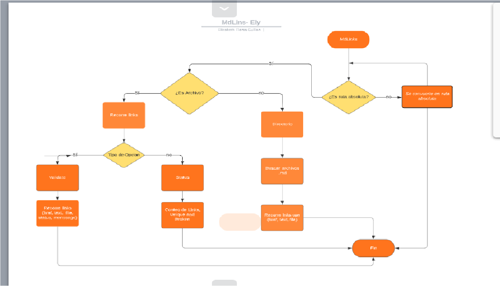

# Proyecto mdlinks-elyfg

## Objetivos
mdlinks-elyfg  It is a library that allows you to search for files that mark the paths of an absolute path or of directories. To validate the links it contains, whether they are broken or stable.


## `DIAGRAMA DE FLUJO MDLINKS`



## Install

npm i mdlinks-elyfg

### CLI (Command Line Interface - Interfaz de Línea de Comando)

The executable of our application must be able to run as follows
way through terminal:

`mdlinks <path-to-file> [options]`

Por ejemplo:

```sh
$ mdlinks ./assets/final.md 
```

#### Options

##### `--validate`

If we pass the `--validate` option, the module should make an HTTP request to
find out if the link works or not. If the link results in a redirect to a
URL that responds ok, then we will consider the link as ok.

$ mdlinks ./assets/final.md --validate </br>

PATH:  C:\Users\eliza\Documents\MdLinks\CDMX009-MdLinks\assets\final.md</br>
LINK:  https://docs.npmjs.com/getting-started/what-is-npm  200  OK</br>
TITLE:  NPM </br>

PATH:  C:\Users\eliza\Documents\MdLinks\CDMX009-MdLinks\assets\final.md </br>
LINK:  https://docs.npmjs.com/getting-started/publishing-npm-packages  200  OK </br>
TITLE:  Publicar packpage </br>

PATH:  C:\Users\eliza\Documents\MdLinks\CDMX009-MdLinks\assets\final.md </br>
LINK:  https://javascript.info/promise-basics  200  OK</br>
TITLE:  Promise </br>

##### `--stats`

If we pass the `--stats` option the output will be a text with statistics
basic on the links. </br>

TOTAL:   3 </br>
UNIQUE:   3 </br>

We can also combine `--stats` and` --validate` to get statistics that
need the results of the validation. </br>

TOTAL:   3 </br>
UNIQUE:   3 </br>
BROKEN:   0 </br>

## Objetivos de aprendizaje

Recuerda colocar en esta seccion los objetivos de aprendizaje que quedaron 
pendientes de tu proyecto anterior.

### Javascript
- [x] Uso de callbacks
- [x] Consumo de Promesas
- [x] Creacion de Promesas
- [x] Modulos de Js
- [x] Recursión

### Node
- [x] Sistema de archivos
- [x] package.json
- [x] crear modules
- [x] Instalar y usar modules
- [x] npm scripts
- [x] CLI (Command Line Interface - Interfaz de Línea de Comando)

### Testing
- [x] Testeo de tus funciones
- [ ] Testeo asíncrono
- [ ] Uso de librerias de Mock
- [ ] Mocks manuales
- [ ] Testeo para multiples Sistemas Operativos

### Git y Github
- [x] Organización en Github

### Buenas prácticas de desarrollo
- [x] Modularización
- [x] Nomenclatura / Semántica
- [ ] Linting

***
